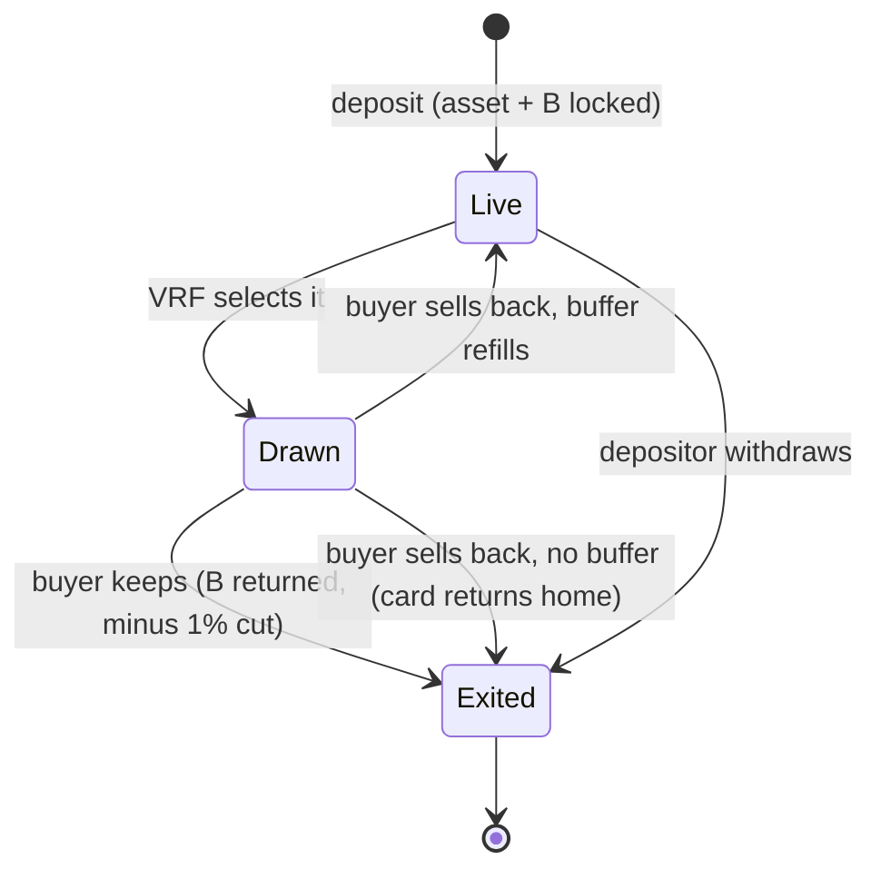

A **position** is an asset plus backing:

```
position = asset + backing B    (B in USDC, minimum $25)
```

The depositor chooses `B` when they deposit. It is the only economic parameter they must set, and it does three jobs at once.

## The three jobs of backing

| Job | Mechanic | Effect |
|---|---|---|
| Buyback bid | The depositor stands ready to reacquire the asset for `B` if it is drawn and the buyer sells back (the buyer receives 90% of it) | Every drawn item has a guaranteed instant exit price |
| Draw weight | `weight = 1 / B` | Cheap positions are drawn constantly; richly backed grails are drawn rarely and sit a long time |
| Stake | `B` is locked while the position is live | Skin in the game; mispricing hurts the depositor, not the pool |

Because all three derive from one number, they cannot drift out of sync. An item's odds of being drawn, its sell-back value, and its owner's exposure are always the same figure viewed from three angles.

A depositor can also add a **buffer**: a prepaid reserve that automatically refills the position after a sell-back, keeping the card in the pool without a manual re-deposit. See [Depositor economics](/depositor-economics#the-buffer-prepaid-re-listing).

## Why this eliminates insolvency

The buyback money is the depositor's own, escrowed at deposit time. There is no shared vault, so:

- No draw can ever create a liability the protocol has not already collected.
- A whale cashing out a grail pays out that grail's own backing, nothing else. Other positions and the protocol are untouched.
- The worst case for the system is a depositor getting exactly what they signed up for.

<Info>
Compare this with vault designs, where payouts come from a common pot and a streak of expensive draws is ruin. In Gabox every possible payout is already funded before the ticket is sold.
</Info>

## Backing is a self-set price

There is no floor oracle. The depositor prices their own item by choosing `B`, and the incentives police it:

- **Back too low** and buyers pull the item cheap. The loss is the depositor's, so underpricing is self-punishing.
- **Back too high** and the position is almost never drawn, earning slow fees while the capital sits locked.

The rational move is to back near the item's honest value, which is exactly what makes the pool's pricing trustworthy. This only works because the eligible assets (NFTs, tokenized assets) have fuzzy floors; a liquid token with a hard DEX price would invite mechanical arbitrage, which is why fungible tokens are out of scope.

## Position lifecycle



A position is live and drawable the moment it is deposited. It cannot alter a draw already in flight, because every draw operates on a snapshot of the pool frozen at request time. See [The draw](/the-draw).

<Note>
A depositor can withdraw an un-drawn position at any time, with one exception: a position that a pending draw has already selected is locked until that draw settles.
</Note>
