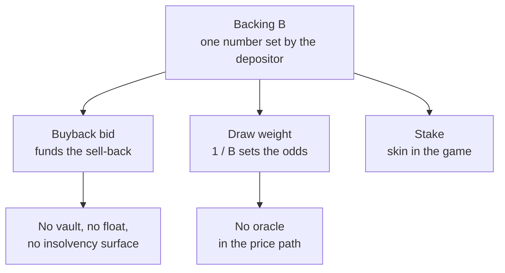

Gabox v3 is the third iteration of the design. Each version answered the previous one's biggest flaw.

## Three versions

| | v1: permissionless machines | v2: curated vault | v3: unified backed-position |
|---|---|---|---|
| Supply | Anyone deploys a machine | Curated category pools | Curated pools over one shared engine |
| Buyback liquidity | Per-machine | Protocol USDC vault | Depositor's own backing, per item |
| Solvency risk | Fragmented, per machine | Risk-of-ruin on the vault | None: every buyback is pre-collateralized |
| Price anchor | Machine owner | Floor price oracle | Self-set backing (harmonic mean) |
| Grail supply | Unsolved | Open question | Crown tithe, built in |
| Deposit cost | Asset only | Asset only | Asset + backing capital |

## What was wrong with v1

Permissionless machines fragmented liquidity and attention. Every machine was its own micro-market with its own thin supply, and discovery was chaos. There was no shared pricing engine and no quality gate.

## What was wrong with v2

v2 fixed fragmentation with curated category pools, but funded buybacks from a **protocol-owned USDC vault**. That works right up until it does not: a jackpot item getting drawn and cashed out drains the vault, and a streak of them is ruin. The protocol carried float, and float means risk-of-ruin. It also needed a floor price oracle in the price path, which is a manipulation surface.

## What v3 changes

v3 unifies everything onto one mechanism: the **backed position**. One number, the backing, does every job the vault and the oracle used to do:

Categories and value tiers still exist, but they are just *views* over the same unified pool engine, not separate systems. See [Pools and tiers](/pools-and-tiers).

## The trade

v3 is not free. Depositors now post capital alongside their asset, where v2 asked for the asset alone. The trade is capital for safety: depositors fund their own buybacks, and in exchange the protocol carries no float and cannot fail. That extra deposit cost is the entire price of eliminating risk-of-ruin.

<Tip>
For a depositor who backs an item at its honest value, the backing comes home on exit. The capital is locked, not spent. See [Depositor economics](/depositor-economics).
</Tip>
