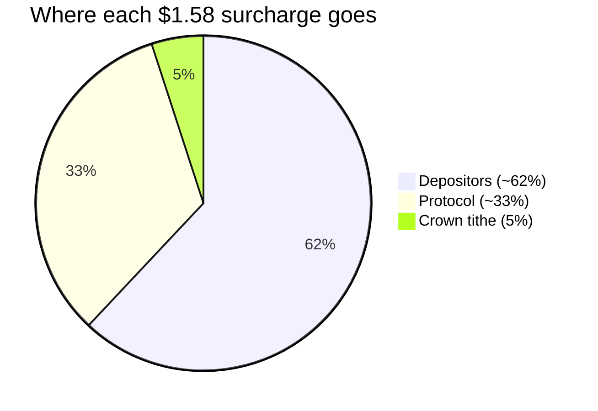
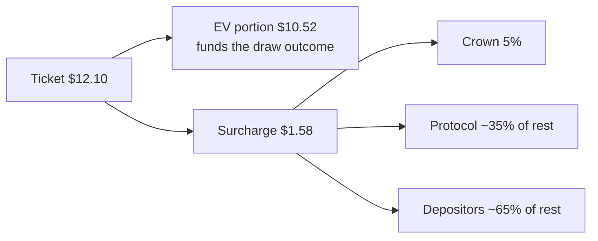

The **surcharge** on each ticket, 15% by default, is the only house cut. Everything the protocol and depositors earn per pull comes out of it.

## The split

Using the [worked example](/pricing) ticket of $12.10, the surcharge is $1.58 per pull:

```
surcharge ($1.58 on a $12.10 ticket)
 |- 5% off the top  -> CROWN (tithe to the top-backed position)
 |_ remainder:
     ~35% -> PROTOCOL
     ~65% -> DEPOSITORS (shared across the pool)
```



| Recipient | Share | Why |
|---|---|---|
| Crown | 5% off the top | The self-funding bounty that attracts a marquee grail. See [The crown](/the-crown) |
| Depositors | ~65% of the remainder | Supply-side yield: the reason to deposit and back honestly |
| Protocol | ~35% of the remainder | Revenue. With no vault and no float, this is pure margin |

## The settlement fee

One other fee exists: when a buyer **keeps** an item, about 1% of the depositor's returned backing is taken as a settlement fee. Sell-backs recycle without it.

## Why protocol revenue is pure margin

In vault designs, protocol income is really a reserve against future buyback obligations, so it is not fully spendable. Gabox's protocol holds no obligations at all, so every dollar of its surcharge share is margin from the moment it is earned.

<Info>
All splits are tunable parameters, not constants. The default leans toward protocol revenue because Gabox has no token; if a token ships, the split can shift toward depositor incentives. The token question is still open, see [Roadmap](/roadmap).
</Info>

## Fee flow per pull


