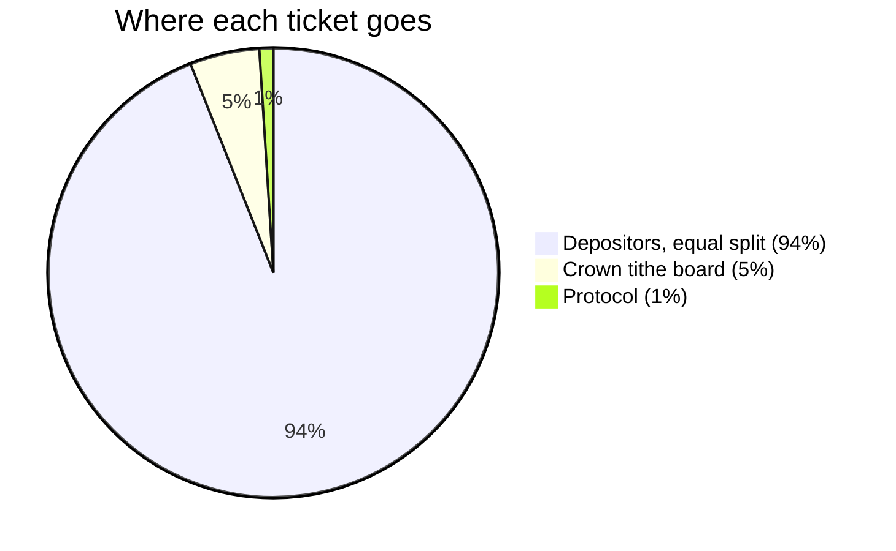
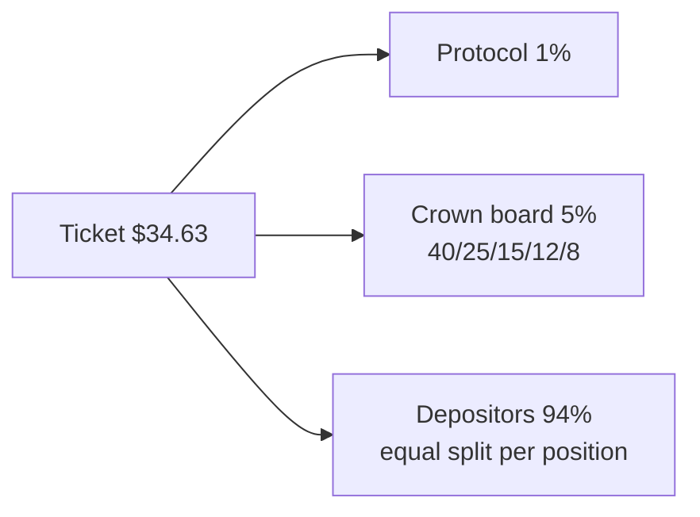

Every ticket is distributed the moment its draw is delivered. Nothing sits in a protocol treasury waiting to cover future payouts: the buyer's sell-back is funded by the drawn depositor's backing, so the ticket itself is pure fee flow.

## The split of every ticket

Using the [worked example](/pricing) ticket of $34.63:

```
ticket ($34.63 = EV $31.48 x 1.10)
 |-  1% -> PROTOCOL (acquisition cut)          $0.35
 |-  5% -> THE CROWN (top-5 tithe board)       $1.73
 |_ 94% -> DEPOSITORS (equal split, per pull)  $32.55
```



| Recipient | Share | Why |
|---|---|---|
| Depositors | 94%, split equally across every live position | Supply-side yield: it rewards being in the pool, which is what keeps the long tail of $25 commons listed |
| Crown board | 5%, split 40/25/15/12/8 across the five top-backed positions | The self-funding bounty that attracts grails. See [The crown](/the-crown) |
| Protocol | 1% acquisition cut | Deliberately small: the ticket is depositor income, not house income |

The depositor share is an **equal split per position**, not proportional to backing. Size is rewarded through the crown board instead, so a $25 common and an $8,000 grail earn the same base share of every pull.

## The settlement fees

Two fees apply at settlement, depending on which branch the buyer takes:

| Branch | Fee | Who pays |
|---|---|---|
| Buyer **sells back** | The buyer receives 90% of the backing; the remaining 10% goes to the protocol as the settlement discount | The drawn depositor's backing funds both |
| Buyer **keeps** | 1% of the returned backing is taken as a settlement cut | The exiting depositor |

The settlement discount on sell-backs is most of the protocol's revenue. The 1% ticket cut exists but is minor by comparison.

## Claiming

Fee income accrues onchain against your position. You claim it whenever you like, and `claim_fees` pays your USDC account directly in one transaction. Accrual never pauses while you wait: the accumulator design means an unclaimed balance just keeps growing.

## The performance fee parameter

The program supports a **performance fee**: a percentage cut of realized fee earnings, stamped on each position at deposit time so it can never be raised retroactively. It exists for third-party pool creators. **Gabox's own pools set it to 0.**

## Why protocol revenue is pure margin

In vault designs, protocol income is really a reserve against future buyback obligations, so it is not fully spendable. Gabox's protocol holds no obligations at all, so every dollar it earns is margin from the moment it is earned.

<Info>
All rates are pool parameters, not constants, and every rate a buyer is exposed to is stamped on their draw at purchase time, so a parameter change can never reprice money already collected. Launch values: 10% surcharge, 1% acquisition cut, 5% tithe, 90% sell-back rate, 1% settlement cut, 0% performance fee.
</Info>

## Fee flow per pull


