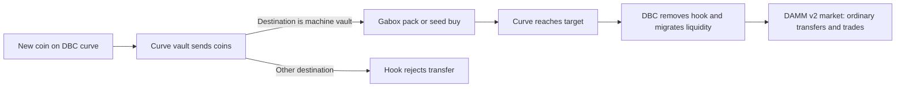

A new Gabox coin starts on a Meteora DBC **bonding curve**: a market whose price changes as coins are bought. Its Token-2022 mint carries the Gabox transfer hook while the curve is open.

The hook checks transfers **out of the DBC curve vault**. Those coins may go only to this coin's Gabox machine vault. Prize payments, wallet transfers and sales into the curve pass. The hook keeps no state; the mint has an empty Token-2022 extra account list so the hook can run.

At launch, the SDK creates the hooked coin and curve, initializes that extra account list, then initializes the machine and buys its seed in the same transaction. The Gabox program checks the registered DBC config, the mint's hook and the hook accounts. A plain coin or a hook pointing elsewhere is refused.

## When the curve completes

DBC migrates the coin into a Meteora DAMM v2 automated market maker (AMM) pool and removes the hook's program from the mint. Gabox then buys and sells through that pool. Its fixed prize table, pack size, vault, pending reservations and referral links carry on. The market price can change at graduation; the pack still means 1,000,000 coin tokens.

When fewer than one whole pack remains on the curve, `buy_packs` cannot buy that remainder. A separate `completeCurve` client operation can buy it into the machine vault so DBC can finish the curve. That operation is outside a pack draw and requires a payer. The program does not automatically advance the curve.

<Note>
The hook and the Gabox program are verified together in the latest recorded devnet deployment. Mainnet's last recorded build predates this design. See [deployment status](/status-and-addresses).
</Note>
