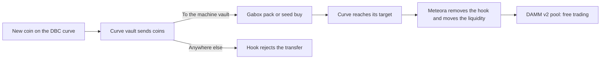

A new Gabox coin starts on a Meteora DBC **bonding curve**: a market whose price rises as coins are bought. While the curve is open, the coin's Token-2022 mint carries the Gabox transfer hook.

```mermaid
flowchart LR
  A[New coin on the DBC curve] --> B[Curve vault sends coins]
  B -->|To the machine vault| C[Gabox pack or seed buy]
  B -->|Anywhere else| D[Hook rejects the transfer]
  C --> E[Curve reaches its target]
  E --> F[Meteora removes the hook and moves the liquidity]
  F --> G[DAMM v2 pool: free trading]
```

## While the curve is open

The hook checks every transfer **out of the curve's vault**. Those coins may only go to this coin's Gabox machine vault. So every buy on the curve is a Gabox pack, or the launch seed. A direct buy through Meteora, a swap app or a bot fails.

Sales into the curve, wallet transfers and prize payments are not affected. The hook keeps no state of its own.

On the curve, the four smaller packs are open. The $1,000 pack stays locked until graduation.

## The graduation target

Each quote token has one registered Meteora config. Its **raise** is how much quote token the curve collects before the coin graduates. The create page shows this target before you launch, and the machine page shows the progress. A machine keeps the config it launched with. A later registration only affects new machines.

## The last pack

The curve stops exactly at its target. The pack that reaches it buys only what is left. It may spend less than its price and get fewer coins, and the unused part stays with the buyer.

## When the curve completes

1. **Migrating.** The curve is full. Meteora's migration moves the liquidity into a DAMM v2 pool. The app pauses packs until the pool exists.
2. **Graduated.** Meteora removes the hook from the mint. The coin now trades freely in the DAMM v2 pool, and anywhere else it is listed.

After graduation:

- Gabox buys and sells through that DAMM v2 pool. It proves the pool from the pool's own data.
- The $1,000 pack unlocks.
- The trading fee drops from 1.875% to 0.94%.
- The pool's liquidity is locked for ever. Gabox owns 67% of the locked position and the creator 33%.
- Pack fees from buyers with no referrer can fill the [Mega Pack](/mega-pack).

The prize table, the vault, open draws and referral links carry on unchanged.
