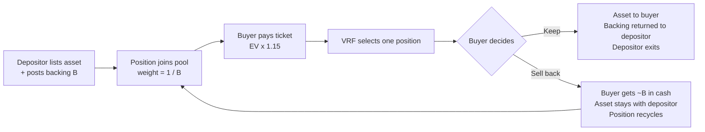

Gabox connects two sides of a market through a pool. Depositors supply assets they are willing to part with at a price. Buyers pay a flat ticket for a random shot at everything inside. The protocol sits in the middle, taking a small surcharge and holding no risk of its own.

## The loop

## Step by step

<Steps>
  <Step title="Deposit">
    A depositor lists an NFT or tokenized asset and pairs it with **backing**, an amount of SOL or USDC they lock next to the asset. Backing is the depositor's own statement of the item's value: it is the price they are willing to buy it back at.
  </Step>
  <Step title="Pricing">
    The pool's ticket price updates automatically. It equals the draw-weighted expected value of the pool (the harmonic mean of all backings) plus a surcharge, 15% by default. See [Pricing](/pricing).
  </Step>
  <Step title="Draw">
    A buyer pays the ticket. MagicBlock VRF selects exactly one position, with probability inversely proportional to its backing: cheap items are drawn constantly, richly backed grails rarely. Draws settle in strict FIFO order so nothing can interfere with a pending request. See [The draw](/the-draw).
  </Step>
  <Step title="Keep or sell back">
    The buyer now owns the outcome and chooses. **Keep** the item, in which case the depositor gets their backing returned and exits. Or **sell it back** for roughly its backing in instant cash, in which case the asset stays with the depositor and keeps earning. See [Keep or sell back](/keep-or-sell-back).
  </Step>
</Steps>

## The three roles

| Role | What they put in | What they get out | What they risk |
|---|---|---|---|
| Depositor | Asset + backing capital | Fee income on every pull, backing returned on exit, possibly the crown tithe | Opportunity cost only: being drawn early before fees accrue |
| Buyer | Ticket price | A random item worth keeping, or instant cash roughly equal to its backing | The surcharge spread between ticket and expected value |
| Protocol | Nothing (no float, no vault) | A share of the surcharge, pure margin | Nothing: it never owes anyone anything |

## Why the house cannot go broke

There is no house bankroll. Every buyback a buyer might claim is the depositor's own backing, locked before the item entered the pool. The protocol never promises a payout it does not already hold in escrow on someone's behalf. Solvency is structural, not a treasury management problem.

<Info>
This is the core difference from vault-based designs, where a lucky streak of jackpot cash-outs can drain a shared buyback fund. In Gabox that scenario cannot exist. See [Design evolution](/design-evolution).
</Info>
