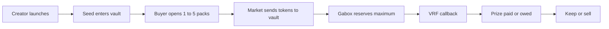

Gabox connects a creator, a market, a buyer, a vault, and MagicBlock VRF.

## The flow

1. **Launch.** A creator opens a machine only for a new coin created with the registered Meteora DBC configuration. The app uses its fixed 10× prize table, and the creator pays the seed.
2. **Price.** The coin trades on DBC, the bonding curve. A pack costs whatever the venue charges for 1,000,000 tokens. After graduation, DAMM v2 sets the live price.
3. **Purchase.** The buyer opens 1 to 5 packs in one trade. The coin goes to the vault. Gabox adds a 0.75% pack fee based on the measured venue charge.
4. **Reservation.** Gabox snapshots the table and inventory, then reserves the batch maximum. Each purchase has its own draw and nonce, so purchases can overlap.
5. **Randomness.** One VRF request resolves the batch. Each pack gets a domain-separated SHA-256 derived 16-bit ticket from the VRF randomness, pool, sequence, and pack index. It maps uniformly to one of 65,536 tickets.
6. **Delivery.** Gabox settles packs in order and sends the total to the buyer. If the account cannot receive, the result becomes owed and can be claimed.
7. **Afterwards.** The buyer keeps the tokens or signs `sell_tokens`. A sale has no pack fee, but the venue still charges 1.25%.

## Graduation

When the DBC curve completes, Meteora migrates the coin to DAMM v2. Gabox binds that pool for later buys and sells. The pack amount, table, vault, reservations, and 0.75% pack fee stay the same.

On devnet, the transfer hook restricts DBC curve buys to the machine vault and DBC removes it at graduation. See [deployment status](/status-and-addresses) before using another network.

## The accounting rule

Tokens purchased, seed, and donations become vault inventory. Inventory is paid out or remains there. Pending reservations cannot be spent by another draw.
