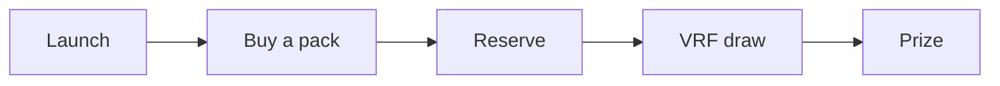

Gabox connects a creator, a market, a buyer, a prize vault and MagicBlock VRF.

```mermaid
flowchart LR
 A[Launch] --> B[Buy a pack]
 B --> C[Reserve]
 C --> D[VRF draw]
 D --> E[Prize]
```

## The flow

1. **Launch.** A creator launches a new coin and its machine in one transaction. The coin uses its quote token's registered Meteora configuration. The creator pays the seed, which buys the first coins into the prize vault.
2. **Price.** The buyer picks a pack from a fixed range of USDC prices. How many coins it buys depends on the market price at that moment.
3. **Purchase.** The buyer pays USDC. On a machine quoted in another token, the same transaction first swaps the USDC into that token. The market sends the bought coins straight to the vault. 0.20% of the price is the pack fee. It goes to the buyer's referrer, to Gabox, or after graduation to the Mega Pack.
4. **Reservation.** Gabox takes a snapshot of the prize table and the free coins in the vault. It reserves the most this pack can pay. Each purchase is its own draw, so many purchases can run at the same time.
5. **Randomness.** MagicBlock VRF sends 32 random bytes back to Gabox. Gabox turns them into one ticket out of 65,536, and the ticket picks a prize row.
6. **Delivery.** Gabox pays the prize to the buyer's coin account. If that account cannot receive it, the prize is recorded as owed and can be claimed later.
7. **Afterwards.** The buyer keeps the coins or sells them. A sale pays the market's trading fee, but no pack fee.

## Graduation

Before graduation, the coin trades on a Meteora DBC bonding curve. A bonding curve is a market whose price rises as coins are bought. The Gabox transfer hook makes sure that only Gabox can buy on it. When the curve has raised its target, Meteora moves the coin into a DAMM v2 pool. After that, anyone can trade the coin, and the largest pack unlocks.

The prize table, the vault and open draws do not change at graduation. See [Transfer hook and graduation](/hook-and-graduation).

## After graduation: the Mega Pack

After graduation, the pack fee of a buyer with no referrer goes into the machine's Mega Pack balance. When the balance reaches its target, Gabox opens a Mega Pack on its own. The coin's holders share what it pulls. See [Mega Pack](/mega-pack).

## The accounting rule

Seed coins, bought coins and donations all enter the vault. Coins leave the vault only as prizes. Coins reserved for open draws and owed prizes cannot be used by another draw.
