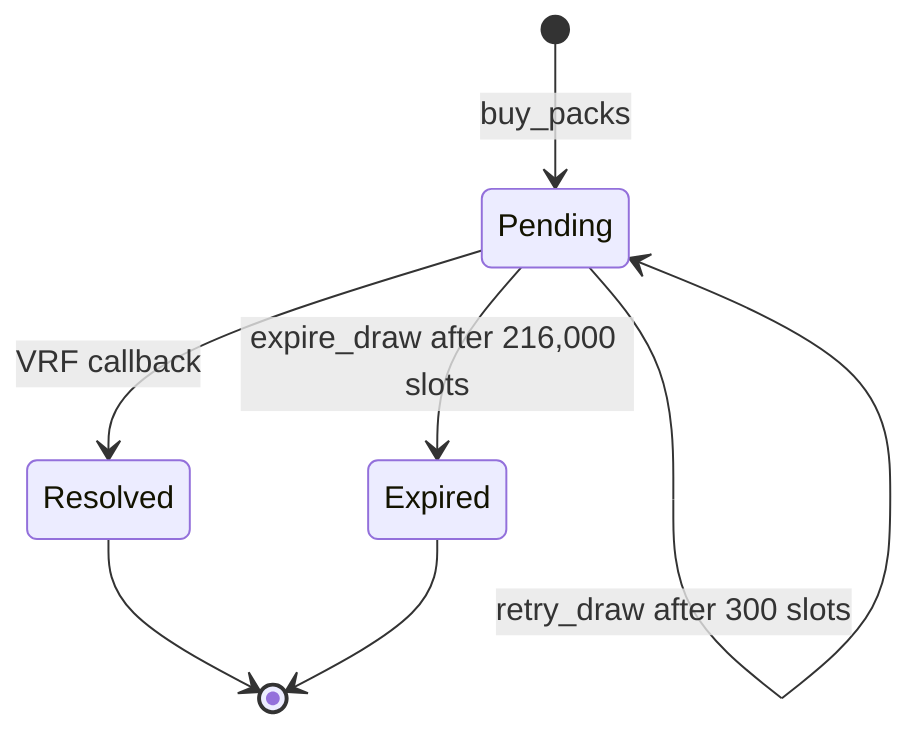

MagicBlock VRF normally answers quickly. The draw has bounded retries and a final timeout.

| Rule | Value |
| --- | --- |
| Retry wait | 300 slots, about 2 minutes after the last attempt |
| Maximum attempts | 3 total, including the first request |
| Timeout | 216,000 slots, about 24 hours from purchase |

## Retry

Anyone can call `retry_draw` after the retry wait. The caller pays the next VRF request and signs `max_vrf_debit`. Retry does not change the frozen table, reservation, or deadline. It is unavailable after three attempts or timeout.

## Expiry

After the slot deadline, anyone can call `expire_draw`. Every pack settles at its smallest prize row. Gabox pays the total or records it as owed. A paid draw closes; an owed draw stays open until claimed. Expiry does not refund the market purchase.

A callback is allowed only before the deadline; expiry is allowed from the deadline onward. If the buyer's account cannot receive, the fixed result stays claimable.
