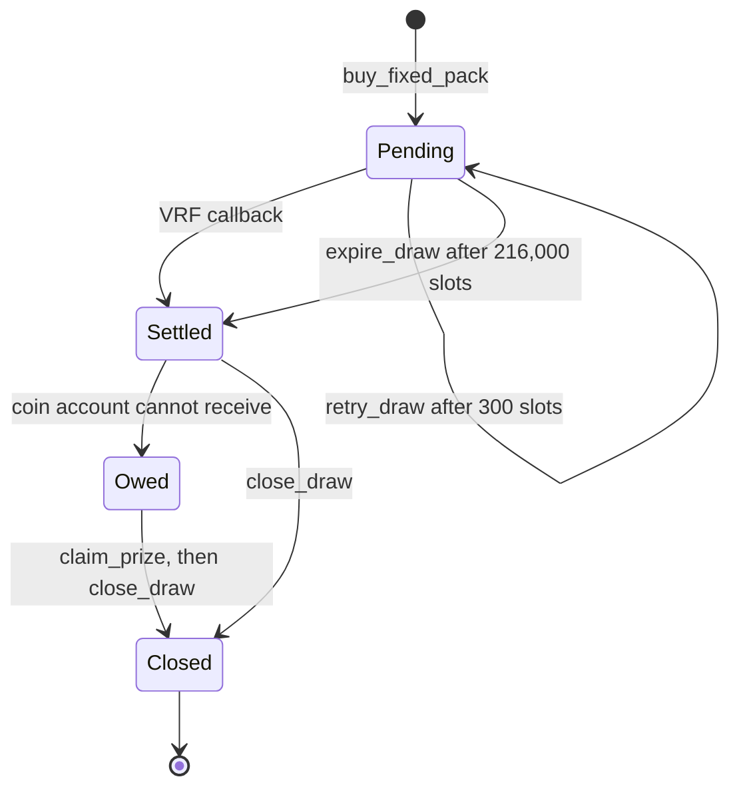

MagicBlock VRF usually answers within seconds. If it does not, the draw has limited retries and a final deadline.

| Rule | Value |
| --- | --- |
| Retry wait | 300 slots after the last request |
| Requests | 3 at most, the first one included |
| Deadline | 216,000 slots after the purchase |

A slot is about 400 milliseconds. So 300 slots is about two minutes, and 216,000 slots is about 24 hours. Slot times can vary, so these are estimates.

```mermaid
stateDiagram-v2
 [*] --> Pending: buy_fixed_pack
 Pending --> Settled: VRF callback
 Pending --> Pending: retry_draw after 300 slots
 Pending --> Settled: expire_draw after 216,000 slots
 Settled --> Owed: coin account cannot receive
 Owed --> Closed: claim_prize, then close_draw
 Settled --> Closed: close_draw
 Closed --> [*]
```

## Retry

Only the buyer can call `retry_draw`, after the retry wait. The buyer pays the next randomness fee and signs `max_vrf_debit`, the most SOL it may cost. A retry does not change the stored prize table, the reservation or the deadline. Every request carries the same `seq`. The first answer that arrives settles the draw. The others then fail and change nothing.

## Expiry

From the deadline on, anyone can call `expire_draw`. The pack then pays its **smallest** prize row, without randomness. The prize is paid or recorded as owed, the same way as a normal result. Expiry never refunds the purchase.

The callback is accepted only before the deadline. Expiry is accepted only from the deadline on. So the two can never both settle a draw.

## Owed prizes

The callback never fails because of your coin account. If the account is missing, closed or cannot receive the coins for another reason, the prize stays in the vault as **owed**. It stays reserved for you.

- `claim_prize`: anyone can send it. It pays the owed prize to your standard coin account and creates that account if needed. The sender pays that account's rent.
- `claim_prize_to`: only you can send it. It pays to any coin account you own.

The app lists owed prizes and claims them for you.

## Closing a draw

A draw account holds a little SOL as rent. When the draw owes and reserves nothing, anyone can call `close_draw`. The rent goes back to the buyer.
