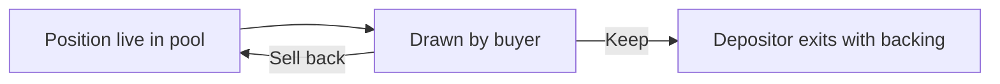

After the draw settles, the buyer owns the outcome and makes one decision with exact numbers on screen: the item's backing versus instant cash.

## The two branches

| | Keep | Sell back |
|---|---|---|
| Buyer gets | The asset | Roughly the item's backing, in cash, instantly |
| Depositor gets | Backing returned (minus ~1% settlement fee) | Keeps the asset, keeps earning fees |
| The position | Exits the pool | Recycles into the pool |
| Who funds it | Nobody: the asset simply transfers | The depositor's own escrowed backing |

## Keep

The buyer liked what they drew. The asset transfers to the buyer, the depositor's backing is released back to them minus a settlement fee of about 1%, and the depositor exits. From the depositor's perspective this is a sale at their self-set price, plus whatever fee income accrued while the position was live.

## Sell back

The buyer wanted the grail, drew a common, and takes the cash. The buyer receives approximately the item's backing, the asset stays with the depositor, and the position goes right back into the pool. The depositor keeps earning fee income as if nothing happened.

This is the **recycling loop**: one deposited asset can be drawn and sold back many times, generating surcharge fees for its depositor on every cycle.

## Why this is safe to promise

The sell-back price is not a market quote that can vanish; it is the depositor's backing, escrowed since deposit. The buyer's exit is guaranteed by construction, and paying it out costs the protocol nothing. See [Backed positions](/backed-positions).

<Note>
The exact settlement accounting for the depositor's backing across keep and sell-back is still being finalized. See [Roadmap](/roadmap).
</Note>

## UX commitment

The keep-or-sell-back screen shows the real numbers, asset backing versus instant cash, with no countdown timers, no pre-selected option, and no dark patterns. The draw is the spectacle; the decision is clean.
