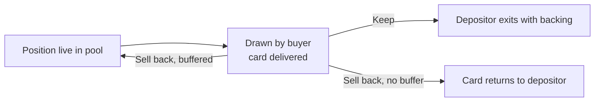

The drawn card is delivered to the buyer first. Then, holding it, the buyer makes one decision with exact numbers on screen: the item itself versus instant cash at 90% of its backing. The window is about five minutes; if it expires, the buyer simply keeps the card they already hold.

## The two branches

| | Keep | Sell back |
|---|---|---|
| Buyer gets | The asset | 90% of the item's backing, in cash, instantly |
| Depositor gets | Backing returned, minus a 1% settlement cut | The asset back (or the buffer relists it automatically) |
| The position | Exits the pool | Closes, or refills from the buffer and stays live |
| Who funds it | Nobody: the asset simply transfers | The depositor's own escrowed backing: 90% to the buyer, 10% to the protocol |

## Keep

The buyer liked what they drew. The asset stays with the buyer, the depositor's backing is released back to them minus the 1% settlement cut, and the depositor exits with whatever fee income accrued while the position was live.

## Sell back

The buyer wanted the grail, drew a common, and takes the cash. The buyer receives 90% of the item's backing, the remaining 10% goes to the protocol, and the card returns to its depositor.

If the depositor posted a **buffer**, the position refills from it automatically instead: the card stays in the pool, the weight is unchanged, and fee accrual never pauses. This is the **recycling loop**: one deposited asset can be drawn and sold back many times, generating fees for its depositor on every cycle. See [Depositor economics](/depositor-economics#the-buffer-prepaid-re-listing).

## Why this is safe to promise

The sell-back price is not a market quote that can vanish; it is the depositor's backing, escrowed since deposit. The buyer's exit is guaranteed by construction, and paying it out costs the protocol nothing. Every number the decision depends on (the 90% rate, the window length) is stamped on the draw at purchase time, so no parameter change can shrink an option the buyer already paid for. See [Backed positions](/backed-positions).

## UX commitment

The decision screen shows the real numbers, asset backing versus instant cash, with the window counted down visibly and the timeout default (keep) stated plainly. No pre-selected option, no dark patterns. The draw is the spectacle; the decision is clean.
