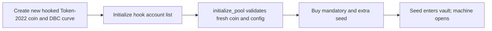

A machine can only open for a brand new Gabox coin. The creator launches a Token-2022 coin through the registered Meteora DBC configuration, then calls `initialize_pool` for that same, still untraded coin.

## What you choose

- **Starting liquidity:** the app uses a fixed prize table with a 10× top row. You choose how many extra seed tokens to buy for the vault. This is an irrevocable donation. SDK clients may supply other valid tables, up to the program's 20× limit.
- **Quote limits:** `max_seed_quote_in` and `max_seed_native_debit`, signed caps for the seed purchase.

The pack size is always 1,000,000 tokens. The creator does not set a fixed pack price. DBC sets the launch price, then DAMM v2 sets the price after graduation.

## Launch checks

The program checks the registered DBC configuration, creator signer, fresh untraded DBC pool, Token-2022 mint rules, prize table, and seed limits. Existing coins and pools that already traded are refused. The transfer hook is verified on devnet; see [deployment status](/status-and-addresses) for other networks.

## After launch

The table, pack size, coin binding, and fee rules cannot change. The creator may call `fund_prizes` to donate more coin tokens. The creator cannot withdraw vault inventory, mint replacement prizes, or borrow from it.

When the DBC curve completes, the coin graduates to Meteora DAMM v2. Gabox binds that pool for future trades. The creator may claim their accumulated 0.75% pack fee share, or 0.25% when a referrer is active.
