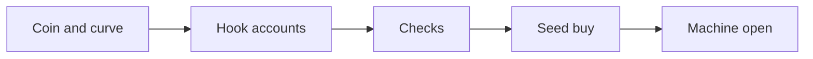

A machine can only open for a brand new coin. The creator launches the coin and its machine in **one transaction**, so nobody can trade the coin before the machine exists.

## What you choose

- **Name, symbol and image.** They go into the coin's own metadata.
- **Quote token.** The token your coin trades against: USDC, SOL, a registered stock token or another registered Solana token. It cannot change later. Buyers still pay for packs in USDC. Your holders' Mega Pack rewards are paid in this token.
- **Starting liquidity.** How many extra jackpots your seed funds. See [Seed and jackpot](/seed-and-jackpot).

Everything else is fixed for every coin: 9 decimals, 1,000,000,000 coins, the app's prize table, the trading fees and the move to DAMM v2 at graduation. A client built on the SDK may pass another valid prize table.

## What happens in the launch transaction

```mermaid
flowchart LR
 A[Coin and curve] --> B[Hook accounts]
 B --> C[Checks]
 C --> D[Seed buy]
 D --> E[Machine open]
```

1. Meteora DBC creates the Token-2022 coin, with the Gabox transfer hook, and its bonding curve. It uses the quote token's registered Gabox config.
2. The hook program creates the coin's account list. The hook needs it to run.
3. `initialize_pool` checks the config, the coin, the hook and the prize table. It refuses a coin that has already traded.
4. The seed buy is the coin's first trade. It buys the seed coins straight into the vault.

If any step fails, nothing happens.

## What it costs

- **The seed**, paid in the machine's quote token. There is no swap at launch, so on a machine not quoted in SOL you must already hold that token. The seed buy pays the curve's trading fee, but no pack fee.
- **SOL** for account rent and the network fee.

You sign `max_seed_quote_in`, the most quote tokens the seed may spend, and `max_seed_native_debit`, the most SOL it may spend. The app shows the estimated launch cost before you sign.

## Launch checks

The program checks that:

- the config is the one Gabox registered for that quote token, with the Gabox fee terms;
- the coin has 9 decimals, the fixed supply and the Gabox hook;
- the curve is new and has had no trade;
- the vault is empty before the seed;
- the prize table is valid, and even the smallest possible buy on this curve pays every row at least one coin unit.

## After launch

The prize table and the coin's market terms cannot change. Anyone can add more prize coins with `fund_prizes`. This is a gift to the vault: nobody can take it back, the creator included.

As creator you earn part of every trade's fee: 0.495% on the curve and about 0.25% after graduation, through your locked share of the pool. You do not earn pack fees on your own machine. See [Referrals and earnings](/referrals-and-earnings).

When the curve reaches its target, the coin graduates. See [Transfer hook and graduation](/hook-and-graduation).
