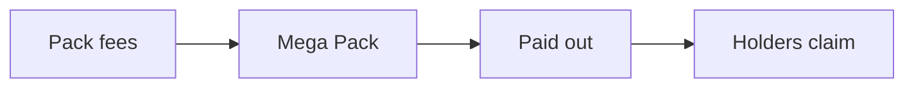

Each graduated machine has a **Mega Pack**. Pack fees fill it. When it is full, Gabox pays it out to the coin's holders.

## How it works

1. **Pack fees fill it.** After graduation, the pack fee of a buyer with no referrer goes into the machine's Mega Pack.
2. **It pays out when full.** When the Mega Pack is worth more than its target, \$1,000 by default, Gabox pays all of it out at once.
3. **Holders share it.** Every holder gets a guaranteed part, based on their balance. The rest is drawn as bonus prizes: Rare, Epic and Mythic. Lucky holders can win 10× their share, or more.
4. **Claim any time.** Your rewards wait for you. Claim them on the machine page or on your profile. There is no deadline.

## Good to know

- Rewards are paid in the machine's quote token, such as USDC or SOL. They are not paid in the coin.
- More coins give you a larger share and more chances to win.
- Very small holdings and addresses that a program controls, such as pools and vaults, do not take part.
- If you sell your coins later, you keep the rewards you already earned.
- Nobody can withdraw the Mega Pack. It can only be paid out to holders.

## Fair and checkable

- The holder balances and the reward rules are fixed on chain before the draw. MagicBlock VRF picks the bonus winners.
- Gabox publishes the balances and the results of every payout, so anyone can check them.

See [Risks](/risks).
