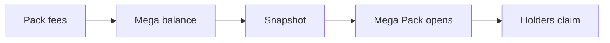

Each graduated machine funds its own **Mega Pack**. Pack fees fill it. When it is full, Gabox opens it on its own, and the coin's holders share what it pulls.



## How it fills

| Purchase | Where the pack fee goes |
| --- | --- |
| Before graduation | The referrer, or Gabox |
| After graduation, with a referrer | The referrer |
| After graduation, no referrer | The machine's Mega balance |

- The Mega Pack must be on for the machine's quote token. Gabox switches it per quote token.
- The balance stays in the machine's own quote token. A USDC machine collects USDC. A stock token machine collects that stock token. Nothing is converted.
- Nobody can withdraw the balance. Only a Mega Pack opening can spend it.

At 0.20%, a \$1,000 target needs about \$500,000 of packs without a referrer after graduation, on that one machine.

## The target

The target is a dollar amount. The default is **\$1,000**. The Gabox admin can set it between \$200 and \$10,000. A change only affects later openings.

On a USDC machine, one USDC counts as \$1. For other quote tokens, Gabox converts the target with a USD market price.

## How it opens

- When a machine's balance covers the target, Gabox opens a Mega Pack on its own. Nobody can trigger an opening by hand, and the exact time is not announced.
- Many machines can be ready at once. Then some wait for a later check. The app shows that a machine is ready, but not an exact time.
- A Mega Pack is an ordinary pack of the target size on that machine. It uses the same prize table, vault caps, randomness, retries and deadline as any pack. So it can pull anything from Common to Mythic. At 3.5×, a \$1,000 Mega Pack pulls about \$3,500 of the coin at the opening price.
- The opening pays no pack fee. The whole budget buys coins. The market's trading fee still applies.
- If the balance covers several targets, several Mega Packs open together. Each is its own pack with its own draw. They are never merged into one bigger pack. Credit that is left waits for a later opening.

## Rounds

The Mega Packs that open together form a **round**. A machine runs one round at a time. The next round starts only after the previous round's rewards are published. Claims never block a new round.

If a round's randomness is late, the whole round waits. In the worst case it waits for the 216,000-slot deadline, and that pack then pays its smallest row. Earlier rewards stay claimable.

## Who shares the prize

Right before the first opening of a round, Gabox takes a **snapshot** of every coin balance. The opening stores the snapshot's slot and hash on chain before the round asks for randomness. These balances decide the whole round. Transfers after the snapshot change nothing.

A holder is eligible when the owner of its token account is a normal wallet address. An address that a program controls (a PDA) has no private key and is not eligible.

| Holder | Eligible |
| --- | --- |
| Normal wallets, the creator's included | Yes |
| Gabox's own normal wallets | Yes |
| Addresses a program controls, such as multisig vaults | No |
| The machine's prize vault and the Mega reward escrow | No |
| Meteora pool vaults and lockers for the coin | No |
| Known burn addresses | No |
| Frozen or invalid token accounts | No |

## How the prize is split

The prizes of a round's packs are added up. Each eligible wallet gets a part in proportion to its snapshot balance:

```text
share = floor(round reward × wallet balance / eligible supply)
```

- **Minimum:** a wallet gets its share only when it is at least **0.01 coin**. A smaller share is skipped for that round. It is not given to other wallets.
- Skipped shares and rounding dust stay unallocated in the escrow for ever.
- Rewards are paid in the coin, not in USDC.
- A wallet that sells its coins keeps every reward it already earned.

## Claiming

Rewards add up per wallet and per machine. **Claim all** pays everything a wallet has earned on a machine, from every round, in one transaction. There is no deadline and no automatic transfer.

- The first claim on a machine creates a small claim account. The wallet pays its rent.
- Your current coin balance does not matter for the claim.

## How to check it

Gabox publishes two files for every round on Irys, and stores their ids on chain:

- the **snapshot file**, with every balance and every exclusion. Its SHA-256 hash is on chain.
- the **distribution file**, with every wallet's total reward so far.

From the distribution file, anyone can rebuild the **Merkle root**: a 32-byte fingerprint of the whole reward list. The program stores that root. A claim must prove that its amount is in the list behind the root. The app builds this proof from the published file.

## What the program enforces

The program enforces the accounting:

- The Mega balance can only be spent by an opening. An opening only buys this machine's coin into this machine's vault.
- Each pack's reward is counted exactly once.
- Claimed ≤ published ≤ funded rewards, at all times. The escrow always holds every unclaimed reward.
- A wallet can never claim more than its total in the published root.
- Each completed round gets exactly one root.

Gabox prepares the snapshot and the reward list. The published files let anyone check them.

See [Risks](/risks) and [Trust boundaries](/trust-boundaries).
