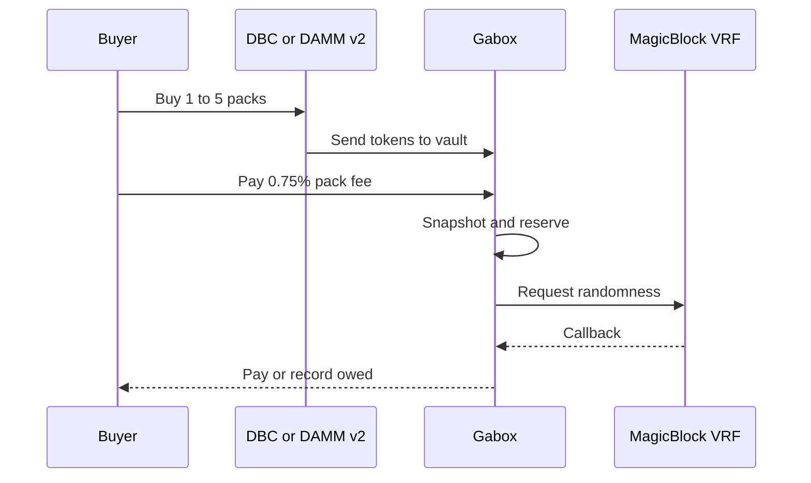

A pack is 1,000,000 tokens. You can open 1 to 5 packs in one purchase.

## Before you sign

The app should show the venue charge, the 1.25% venue fee included in it, the 0.75% Gabox pack fee, the capped first maximum, VRF cost, rent, and network fee.

You sign `max_quote_in`, covering venue charge plus pack fee. You also sign `min_first_maximum`, a floor for the first pack's displayed top prize, and `max_native_debit` for SOL spent inside the instruction, including the VRF request and certain venue or referral account costs. Draw and other accounts created before the handler, plus the network fee, sit outside that native cap. A stale quote fails if it exceeds a signed limit.

## The purchase

The venue sends the bought tokens directly to the vault. Gabox records the batch, reserves its maximum, and requests one MagicBlock VRF result. Purchase and reservation are atomic.

## The draw

The table is frozen at purchase. Each pack gets its own domain-separated SHA-256 derived 16-bit ticket from the VRF randomness, pool, sequence, and pack index. That ticket selects one of 65,536 equal chances. The batch settles in order.

If the buyer's account is missing or cannot receive, the callback still fixes the result. Use `claim_prize` later, or `claim_prize_to` to an account you own.

## Referrals

A buyer may name a referrer on any purchase before a link exists. The first valid referrer binds permanently for that buyer. The buyer pays the same either way. The referrer receives 0.50% of the venue charge, and the creator receives the remaining 0.25% pack fee. Without a referrer, the creator receives all 0.75%.

See [What a pack costs](/what-a-pack-costs), [Prizes and odds](/prizes-and-odds), and [If the draw is late](/if-the-draw-is-late).
