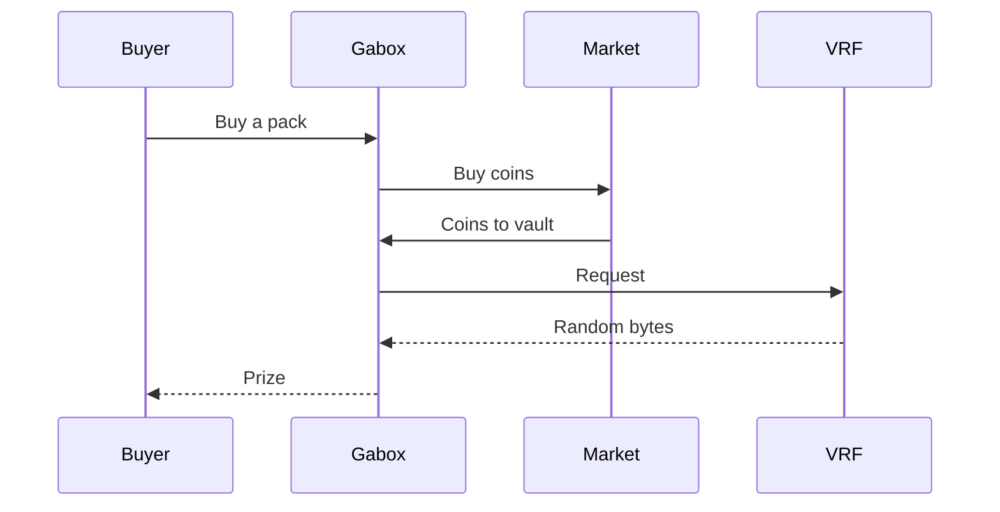

A pack has a fixed USDC price. You open one pack per purchase, and each pack gets its own draw.

## Pick a pack

Gabox offers a fixed range of pack prices, from small to large. The app shows the current prices on every machine. The largest pack unlocks only after the coin graduates. All other packs are always available.

The price includes the 0.20% pack fee and the market's trading fee. It does not include network fees, account rent or the randomness fee. You pay those in SOL.

The price buys coins on the market. So the number of coins in a pack changes with the coin's price. When the coin trades higher, a pack at the same price buys fewer coins.

## How you pay

You always pay in USDC.

- **USDC machine.** The program takes the price straight from your USDC account.
- **Any other machine** (SOL, a stock token or another Solana token). The same transaction first swaps your USDC into the machine's quote token. Then it buys the pack with that token. Quote tokens that the purchase did not use go back to you. On a SOL machine they come back as SOL.

The swap is a separate trade with its own price and fees.

## What you sign

| Limit | What it protects |
| --- | --- |
| `max_quote_budget` | The most quote tokens the pack may spend, pack fee included. |
| `min_net_tokens` | The fewest coins the vault must receive for your pack. |
| `min_maximum` | The smallest top prize you accept. If the vault changed and the top prize fell below this, the purchase fails. |
| `max_native_debit` | The most SOL the program may spend inside the purchase: the randomness fee and some account rent. |

Your first pack on a machine also creates a small account for your [Mega Pack](/mega-pack) rewards. You pay its rent once.

Some accounts are created before the program runs, for example the draw account. Their rent and the network fee are outside `max_native_debit`. The app shows them before you sign. If the market moved and a limit no longer holds, the transaction fails and nothing is bought.

## The purchase

The market sends the bought coins straight to the vault. Gabox records the draw, reserves its top prize and asks MagicBlock for randomness. All of this happens in one transaction.

```mermaid
sequenceDiagram
 participant B as Buyer
 participant G as Gabox
 participant M as Market
 participant V as VRF
 B->>G: Buy a pack
 G->>M: Buy coins
 M->>G: Coins to vault
 G->>V: Request
 V-->>G: Random bytes
 G-->>B: Prize
```

## The draw

Your draw keeps its own copy of the prize table, your pack coins and the free coins in the vault. Later purchases cannot change your result. MagicBlock usually answers in a few seconds. The prize then goes to your coin account.

If your coin account cannot receive the prize, the result is still fixed. The prize waits in the vault as owed. See [If the draw is late](/if-the-draw-is-late).

## The last pack on the curve

The curve stops at its target. The pack that reaches the target buys only what is left on the curve, so it may spend less than its price and buy fewer coins. The unused part stays with you. After that, the app pauses purchases until Meteora finishes the move to DAMM v2.

## Referrals

You may name a referrer on a purchase if you do not have one yet. The first valid referrer is bound to your wallet for ever. You pay the same price either way. See [Referrals and earnings](/referrals-and-earnings).

Read next: [What a pack costs](/what-a-pack-costs) and [Prizes and odds](/prizes-and-odds).
