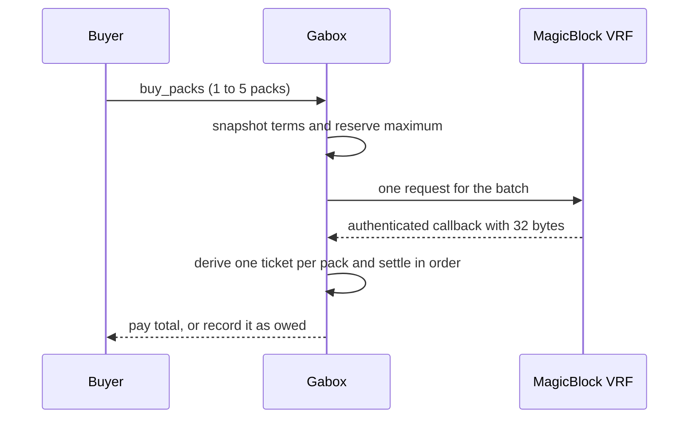

The machine's prize table is fixed at launch. The app uses a 10× top row; another client can submit a different valid table. Each row has a token multiplier and a number of **tickets**. The ticket counts must total 65,536. Your purchase stores the table, pack size and free vault inventory in its draw, so later purchases cannot change its result.

For pack `k`, Gabox hashes the 32 random bytes, machine address, batch starting sequence and `k`. The first two hash bytes, read as a little-endian number, give a ticket from 0 to 65,535. The ticket falls into exactly one row. Using 65,536 tickets matches the 16-bit range, so no modulo reduction is needed.

Each row's nominal prize is `floor(1,000,000 tokens × multiplier_bps / 10,000)`. The amount paid to a pack is capped by available vault tokens at that pack's turn. Packs in a batch settle in order; an earlier award changes the cap for later packs. [Funding](/always-funded) explains the reservation.

## Verify your purchase

1. Find `PacksBought` for your draw. It records the batch, `seq_start`, free inventory snapshot and first pack's prizes.
2. Find `DrawResolved` for that draw. It records the 32 bytes, each pack's row and amount, total, `timed_out` and `paid`.
3. Recompute the tickets and amounts with the SDK's `settle(...)` function, or the formula above. Compare each result and the total.

If `timed_out` is true, randomness was not used: every pack gets its smallest prize row. If `paid` is false, the outcome is fixed but [still needs a claim](/if-the-draw-is-late).

The program authenticates MagicBlock's scoped callback and ties it to this draw's sequence. MagicBlock's randomness and delivery are external trust dependencies; see [trust boundaries](/trust-boundaries).
