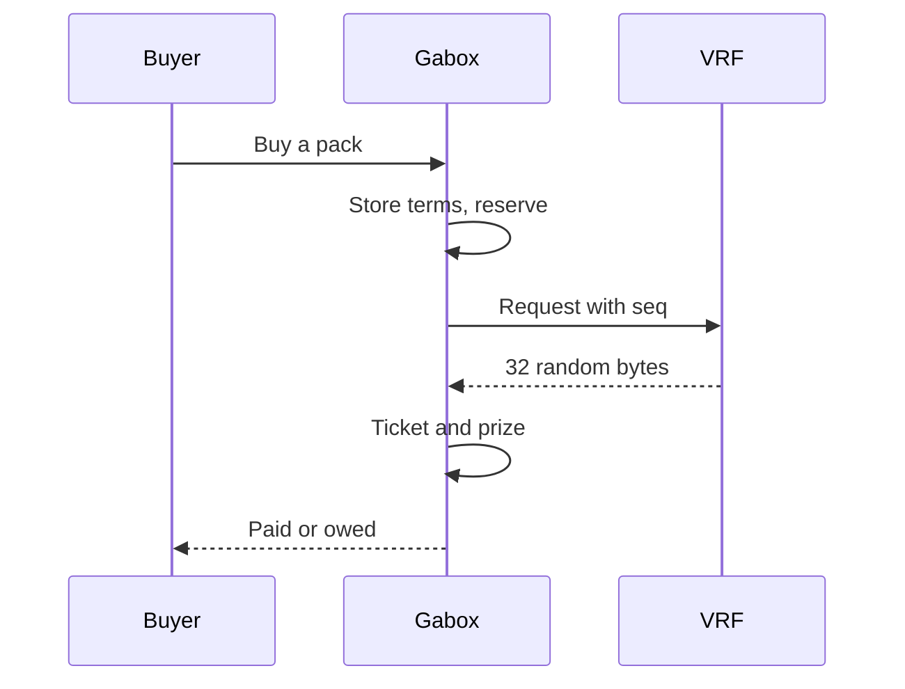

Every pack is one draw. When you buy, the draw stores the prize table, your pack coins and the free coins in the vault. Later purchases cannot change these numbers, so they cannot change your result.

```mermaid
sequenceDiagram
 participant B as Buyer
 participant G as Gabox
 participant V as VRF
 B->>G: Buy a pack
 G->>G: Store terms, reserve
 G->>V: Request with seq
 V-->>G: 32 random bytes
 G->>G: Ticket and prize
 G-->>B: Paid or owed
```

## From random bytes to a prize

1. Gabox hashes three values with SHA-256: the 32 random bytes, the machine's address and the draw's sequence number (`seq`, 8 bytes, little-endian).
2. The first two bytes of the hash, read as a little-endian number, are the ticket: a number from 0 to 65,535.
3. The rows own consecutive ranges of tickets, in table order. The ticket falls into exactly one row.
4. The prize is `min(floor(pack coins × multiplier / 10,000), free coins + pack coins)`.

There are exactly 65,536 tickets, which is the full range of a 16-bit number. So every ticket has the same chance, and no rounding favours a row.

Each machine gives every pack a new `seq`, and it never repeats. A callback must carry the same `seq` as the draw, so a random value can only settle the draw that asked for it.

## Verify your pack

1. Find the `PackBoughtV2` event of your purchase. It records the draw, `seq`, your pack coins (`tokens_bought`), the free coins snapshot and the prize offer.
2. Find the `DrawResolved` event of that draw. It records the 32 random bytes, the row, the amount, and the `timed_out` and `paid` flags.
3. Recompute the ticket and the prize with the steps above, or with the SDK's `settle(...)` function. Compare them with the event.

If `timed_out` is true, no randomness was used: the draw paid its smallest row. If `paid` is false, the result is fixed but [still needs a claim](/if-the-draw-is-late).

The program checks that the callback comes from MagicBlock's authority for this program and carries the right `seq`. It relies on MagicBlock to generate the bytes fairly and to deliver them. See [trust boundaries](/trust-boundaries).
