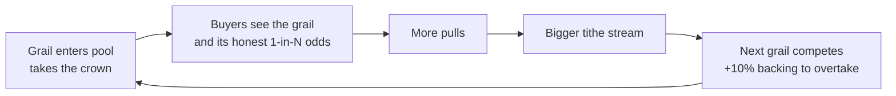

A gacha pool is only exciting if there is something worth chasing. The crown is Gabox's answer to the question every version of this design struggled with: **how do grails surface for FOMO?**

## The mechanic

The single **top-backed position** in a pool holds the crown, and the crown earns a **tithe: 5% of every pull's surcharge, pool-wide**, for as long as it holds the title.

| Rule | Value |
|---|---|
| Who holds it | The one position with the highest backing in the pool |
| What it earns | 5% of the surcharge on every pull in the pool |
| How to take it | Beat the current holder's backing by at least 10% |
| When the pot pays | When the holder is overtaken, or when the position exits |

## Why it works

The crown is a bribe, and it funds itself. A whale considering whether to deposit an $8,000 grail is being offered a yield stream skimmed from every $12 ticket the commons traffic generates. The busier the pool, the bigger the bribe, the stronger the pull on marquee items, and a visible grail in the pool is exactly what makes buyers pull tickets. The loop closes:

Recall that a heavily backed position is drawn extremely rarely (`weight = 1 / B`), so a crown holder mostly just sits there, earning the tithe, being visible. That visibility is itself the product: the pool page shows who holds the crown and what it is earning, both a trust signal (a real grail is in the pool) and a FOMO driver.

## Anti-flipping design

Two rules dampen crown games:

- The **10% overtake margin** means flipping the crown back and forth requires real escalating capital, not one-dollar increments.
- **Payout on overtake or exit** means the accrued pot rewards tenure; camping briefly and leaving forfeits nothing to you but ends your accrual.

The residual concern is a rich whale camping the crown indefinitely, a rich-get-richer dynamic that is watched but not currently mitigated. See [Safety](/safety).
