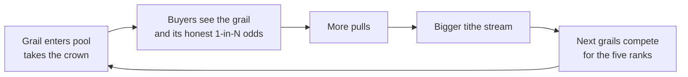

A gacha pool is only exciting if there is something worth chasing. The crown is Gabox's answer to the question every version of this design struggled with: **how do grails surface for FOMO?**

## The mechanic

Every pool has a **board of five slots**, ranked by backing. The board earns a **tithe: 5% of every ticket, pool-wide**, split across the ranks. Rank 1 is the crown.

| Rank | Share of the 5% tithe |
|---|---|
| 1 (the crown) | 40% |
| 2 | 25% |
| 3 | 15% |
| 4 | 12% |
| 5 | 8% |

| Rule | How it works |
|---|---|
| Who holds a rank | The five positions with the highest backing in the pool |
| What a rank earns | Its share of 5% of every ticket, paid instantly on every pull |
| How to take a rank | Back more than the current occupant. Losing a challenge is harmless: your deposit lands either way, you just do not take the slot |
| When a new rank starts earning | After the **commitment window**: the slot must be held through 32 fee recognitions before it pays. Until then its share routes to the pool default |
| When earnings pay | Immediately, every pull, into the occupant's claimable balance. There is no pot to forfeit and nothing to vest |

## Why it works

The crown is a bribe, and it funds itself. A whale considering whether to deposit an $8,000 grail is being offered 40% of a tithe skimmed from every ticket the commons traffic generates. The busier the pool, the bigger the bribe, the stronger the pull on marquee items, and a visible grail in the pool is exactly what makes buyers pull tickets. The loop closes:

Recall that a heavily backed position is drawn extremely rarely (`weight = 1 / B`), so a board occupant mostly just sits there, earning the tithe, being visible. That visibility is itself the product: the pool page shows the board, who holds each rank, and what each rank is earning, both a trust signal (real grails are in the pool) and a FOMO driver.

Five ranks instead of one winner also means the contest is never over: losing the crown drops you to rank 2, it does not zero you, and the next whale always has a rung to enter on.

## Anti-gaming design

Two rules close the obvious games:

- **The commitment window.** Rank is taken by backing, and backing can move in a single transaction. Without a window, an attacker could raise their backing, capture a pull's tithe, and withdraw the raise, all atomically, holding rank for zero real time. A slot therefore earns only after its occupant has held it through 32 fee recognitions; until it matures, that slot's share routes to the pool's default destination, the same as an empty slot. Rank costs committed capital, not flash capital.
- **Instant payout, no pot.** Each rank is paid its share at the moment of every pull. There is no accrued pot to snipe, and an evicted occupant keeps everything they earned while seated.

A rich whale camping the crown indefinitely is structurally bounded: rank 1 earns 40% of the tithe and no arrangement of capital earns more. See [Safety](/safety).

<Note>
A pool with fewer than five qualifying positions has empty slots, and an occupant who shrinks their backing keeps a stale slot until someone challenges it. Anyone can call the permissionless board refresh to seat the rightful occupant; the refresh always seats the position's owner, never the caller.
</Note>
