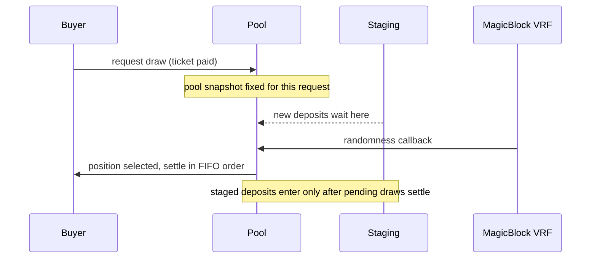

A draw selects exactly one position from the pool. Two properties matter: the randomness must be verifiable, and nobody may be able to influence a draw that is already in flight.

## Selection

Randomness comes from **MagicBlock VRF** (see their [roll-dice example](https://github.com/magicblock-labs/magicblock-engine-examples/tree/main/roll-dice/anchor)). Each position's chance of being selected is proportional to its draw weight:

```
weight(i)      = 1 / B_i
P(i is drawn)  = weight(i) / totalWeight
```

The consequences of inverse weighting:

| Position | Backing | Behavior in the pool |
|---|---|---|
| Common card | $8 | Drawn constantly, capital turns over fast |
| Mid item | $120 | Drawn occasionally |
| Grail | $8,000 | Drawn rarely, sits a long time collecting fees |

This is the same `B` that sets the buyback bid and the ticket price, so odds shown to buyers are always consistent with what the pool charges. See [Pricing](/pricing).

## FIFO settlement

Draw requests settle strictly in creation order. New deposits do not enter the live pool immediately; they wait in a **staging line** until every pending draw has settled.



This closes two manipulation windows:

- **Deposit timing**: nobody can inject or remove a position to reshape the odds of a draw that has already been paid for.
- **Callback timing**: the order VRF callbacks land in cannot reorder outcomes, because settlement order is fixed at request time.

## What the buyer is quoted

The buyer pays the pool ticket plus the VRF service fee, with optional slippage bounds since the ticket moves as positions enter and exit. The exact odds table for the pool, including the grail's 1-in-N chance, is displayed before purchase; verifiability is the aesthetic.

After settlement the buyer immediately faces one choice: [keep or sell back](/keep-or-sell-back).
