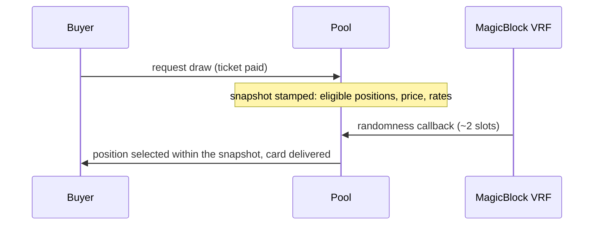

A draw selects exactly one position from the pool. Two properties matter: the randomness must be verifiable, and nobody may be able to influence a draw that is already in flight.

## Selection

Randomness comes from **MagicBlock VRF** (see their [roll-dice example](https://github.com/magicblock-labs/magicblock-engine-examples/tree/main/roll-dice/anchor)). Each position's chance of being selected is proportional to its draw weight:

```
weight(i)      = 1 / B_i
P(i is drawn)  = weight(i) / totalWeight
```

The consequences of inverse weighting:

| Position | Backing | Behavior in the pool |
|---|---|---|
| Common card | $25 | Drawn constantly, capital turns over fast |
| Mid item | $250 | Drawn occasionally |
| Grail | $8,000 | Drawn rarely, sits a long time collecting fees |

This is the same `B` that sets the buyback bid and the ticket price, so odds shown to buyers are always consistent with what the pool charges. See [Pricing](/pricing).

## The frozen snapshot

When a buyer pays, the draw request stamps a **snapshot of the pool as of that moment**: the set of positions the draw ranges over, the price, and every rate the buyer is exposed to. The VRF callback selects strictly within that snapshot.



This closes the manipulation windows:

- **Deposit timing**: deposits stay open while draws are in flight, but a new position lands outside every pending snapshot, so nobody can inject a position to reshape the odds of a draw that has already been paid for.
- **Withdrawal timing**: a position that has been selected by a pending draw cannot be withdrawn out from under it.
- **Parameter timing**: the price and rates are stamped at payment, so no later change can reprice a draw already bought.

## If the oracle goes quiet

The buyer's money is never stuck behind a silent oracle:

- **Re-arm**: if no callback lands within a couple of minutes, anyone can re-arm the request, funded from the SOL reserve the buyer escrowed (up to three attempts).
- **Abandon**: if the draw is still unanswered a day after the last attempt, the buyer can abandon it for a full refund of the ticket.

## What the buyer is quoted

The buyer pays the pool ticket plus the VRF fee, with a slippage bound since the ticket moves as positions enter and exit. The exact odds table for the pool, including the grail's 1-in-N chance, is displayed before purchase; verifiability is the aesthetic.

The card is delivered first, then the buyer faces one choice: [keep or sell back](/keep-or-sell-back).
